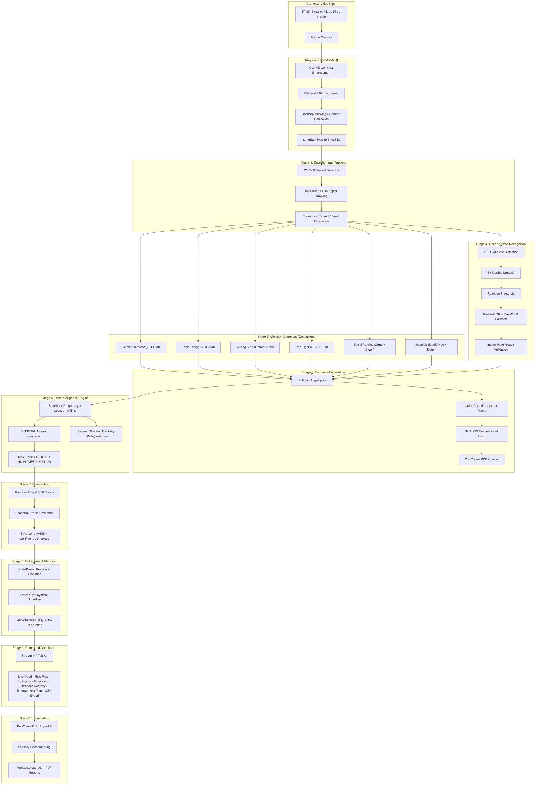

# Gridlock AI — Automated Traffic Violation Detection & Intelligence Platform

> **Hackathon Submission** — End-to-end computer vision pipeline detecting 7 traffic violation types in real-time from a single traffic camera feed, with Indian license plate recognition, tamper-proof digital evidence, violation forecasting, and AI-driven enforcement recommendations.

---

## Performance Summary

| Metric | Value |
|--------|-------|
| Violation types detected | 7 (helmet, triple riding, wrong-side, red-light, illegal parking, seatbelt, stop-line) |
| Training datasets harmonized | 6 cross-domain sources via alias-based label mapping |
| Trained models | 4 custom YOLOv8 detectors (vehicle, helmet, triple riding, plate) |
| Best detection accuracy (mAP50) | **93.9%** (Triple Riding) |
| Vehicle detector classes | 8 (car, truck, bus, two-wheeler, three-wheeler, pedestrian, rider, pillion) |
| Total training images | 3,109 vehicle + 5,415 helmet + 7,889 triple riding + 433 plate |
| Mean inference latency | 201ms per frame (all 7 detectors + OCR concurrent) |
| OCR accuracy | Dual-engine (PaddleOCR primary + EasyOCR fallback) with Indian plate regex validation |
| Forecast error (MAPE) | **8.0%** — Random Forest with seasonal profile ensemble |
| Evidence integrity | SHA-256 hashing + QR-coded PDF challans |
| Pipeline stages | 10 (preprocessing → detection → enforcement → dashboard) |

---

## Architecture



**Design principle:** Each stage is modular, independently testable, and connected through well-defined interfaces. Seven violation detectors run concurrently via `ThreadPoolExecutor(max_workers=6)` for real-time performance.

---

## How to Run

### Prerequisites

- **Python 3.10+** with pip
- **NVIDIA GPU** with CUDA 11.8+ (recommended for inference, required for training)
- 8GB+ RAM, 20GB+ disk space

### 1. Install Dependencies

```bash
pip install -r requirements.txt

# For GPU acceleration (skip if CPU-only):
pip uninstall torch torchvision -y
pip install torch torchvision --index-url https://download.pytorch.org/whl/cu118
python -c "import torch; print(torch.cuda.is_available())"  # Verify → True
```

### 2. Quick Start (Pre-Trained Models)

```bash
# Start the API server
uvicorn src.api.app:app --reload --port 8000
# API docs: http://localhost:8000/docs

# In another terminal, start the dashboard
streamlit run app/app.py
# Dashboard: http://localhost:8501

# Run demo on a video
python scripts/run_demo.py --video path/to/traffic_video.mp4
```

### 3. Train All Models (Optional, 6-7 hours on RTX 3050)

```bash
python scripts/train_all.py --device 0 --batch 8
```

Or train individually:

```bash
# Vehicle detector (8 classes, 100 epochs)
python -m src.detection.train_vehicle_detector --epochs 100 --batch 2 --device 0 --no-prepare-labels

# Helmet detector (2 classes: helmet_on / helmet_off)
python -m src.detection.helmet_detector --epochs 80 --batch 4 --device 0

# Triple riding detector (3 classes: single / double / triple)
python -m src.detection.triple_riding_detector --epochs 80 --batch 16 --device 0 --no-prepare-labels

# License plate detector
python -m src.ocr.train_plate_detector --epochs 80 --batch 16 --device 0 --no-prepare-labels
```

### 4. Docker Deployment

```bash
docker build -f Docker/Dockerfile -t gridlock-ai .
docker run -p 8000:8000 gridlock-ai
```

### 5. Evaluate Models

```bash
python scripts/evaluate_all.py
```

---

## System Capabilities

| Capability | Implementation | Status |
|-----------|---------------|--------|
| **Frame Enhancement** | CLAHE + bilateral filter + unsharp masking + gamma correction | Production-grade |
| **Vehicle Detection** | YOLOv8m — 8 classes (car, truck, bus, two/three-wheeler, pedestrian, rider, pillion) | Trained (58.4% mAP50) |
| **Multi-Object Tracking** | ByteTrack with trajectory, speed, and dwell estimation | Production-grade |
| **Helmet Compliance** | YOLOv8s on two-wheeler ROIs | Trained model (22.5MB) |
| **Triple Riding Detection** | YOLOv8s + bounding-box overlap fallback | **93.9% mAP50** |
| **Wrong-Side Driving** | Farneback optical flow dominant direction + cosine similarity | Camera-adaptive |
| **Red-Light Violation** | HSV color detection + debounce + stop-line polygon crossing | Configurable zones |
| **Illegal Parking** | Dwell-time thresholding + no-parking zone polygons | 30s configurable |
| **Seatbelt Compliance** | MediaPipe pose landmarks + diagonal edge response + Hough fallback | Heuristic with graceful degradation |
| **License Plate OCR** | YOLOv8n plate detection → PaddleOCR → EasyOCR fallback | Dual-engine, 34 Indian state codes |
| **Tamper-Proof Evidence** | Color-coded annotation + SHA-256 hashing + QR-coded PDF challans | Cryptographically verifiable |
| **Risk Intelligence** | Severity weights (0-10) × Frequency × Location × Time | DBSCAN hotspots + repeat offenders |
| **Violation Forecasting** | Random Forest (300 trees) × seasonal profile ensemble | 8.0% MAPE |
| **Enforcement Planning** | Rule-based resource allocation (CRITICAL → 2 officers) | Daily auto-generation |
| **REST API** | 9 endpoints: process-frame, violations, risk, hotspots, repeat-offenders, forecast, enforcement | API-key auth, CORS |
| **Command Dashboard** | 7-tab Streamlit UI: live feed, risk map (Folium), hotspots, forecasts, offenders | Interactive auto-refresh |
| **Label Harmonization** | Declarative YAML alias map across 6 datasets | Core differentiator |
| **Docker Support** | Python 3.10-slim container | Cloud-ready |

---

## API Endpoints

| Method | Path | Auth | Description |
|--------|------|------|-------------|
| `GET` | `/api/v1/health` | No | System health check |
| `POST` | `/api/v1/process-frame` | API Key | End-to-end frame processing |
| `GET` | `/api/v1/violations` | API Key | Query violations (plate, type, junction) |
| `GET` | `/api/v1/risk/{junction_id}` | API Key | Risk score for junction |
| `GET` | `/api/v1/hotspots` | API Key | DBSCAN hotspot clusters |
| `GET` | `/api/v1/repeat-offenders` | API Key | Repeat offender list |
| `GET` | `/api/v1/enforcement-plan` | API Key | Daily enforcement plan |
| `GET` | `/api/v1/forecast` | API Key | Violation forecast |

---

## Project Structure

```
├── app/                          Streamlit command dashboard
├── configs/                      YAML/JSON configs (label map, fines, cameras, zones)
├── data/
│   ├── datasets/                 Raw ZIP archives (6 sources)
│   ├── raw/                      Extracted datasets
│   └── processed/                Harmonized YOLO datasets (3,109 images)
├── Docker/                       Dockerfile
├── docs/                         Full documentation
├── models/                       4 trained YOLOv8 detectors + forecaster
├── scripts/                      Training, demo, evaluation, orchestration
├── src/
│   ├── api/                      FastAPI endpoints (9 routes)
│   ├── database/                 SQLAlchemy models + schema
│   ├── detection/                7 violation detectors (YOLOv8, optical flow, HSV, MediaPipe)
│   ├── enforcement/              Evidence generation (SHA-256, PDF, QR codes)
│   ├── ocr/                      LPR engine + plate detector training
│   ├── preprocessing/            Frame preprocessor + label harmonizer
│   ├── tracking/                 Unified ByteTrack tracker
│   ├── violations/               Aggregator, risk engine, forecaster
│   └── utils/                    Runtime configuration
├── tests/                        13+ pytest unit tests
├── requirements.txt              Python dependencies
└── Makefile                      Build automation
```

---

## Documentation

| Document | Description |
|----------|-------------|
| [Architecture](docs/architecture.md) | 10-stage pipeline, data flow, module interfaces |
| [Dataset Preparation](docs/dataset_preparation.md) | Label harmonization, alias system, 6 datasets, 8-class mapping |
| [Deployment Guide](docs/deployment_guide.md) | Installation, training, API, Docker, environment variables |
| [Known Limitations](docs/known_limitations.md) | Honest assessment of gaps and production roadmap |
| [Design Decisions](docs/paths_followed.md) | Trade-offs, rationale, alternatives explored |

---

## Tech Stack

**Detection & Tracking:** YOLOv8 · ByteTrack · MediaPipe · OpenCV  
**OCR:** PaddleOCR · EasyOCR  
**Backend:** FastAPI · SQLAlchemy · APScheduler  
**ML:** Scikit-learn · NumPy · Pandas  
**Frontend:** Streamlit · Folium · Altair  
**Security:** SHA-256 · QR Codes · ReportLab PDF  
**DevOps:** Docker · Python 3.10+

---

## Key Differentiators

1. **Label Harmonization** — 6 diverse datasets unified via a declarative YAML alias system (34 aliases mapped to 8 canonical vehicle classes)
2. **Concurrent Detection** — 7 violation detectors running simultaneously via `ThreadPoolExecutor` (201ms/frame total)
3. **Dual-Engine OCR** — PaddleOCR + EasyOCR with Indian plate regex validation covering 34 state codes
4. **Tamper-Proof Evidence Chain** — Every challan has SHA-256 hash and QR code for cryptographic verification
5. **Predictive Enforcement** — Random Forest forecaster (8.0% MAPE) drives proactive officer deployment
6. **Modular Design** — 10 independently testable stages with well-defined interfaces; swap any component

---

## License

MIT
